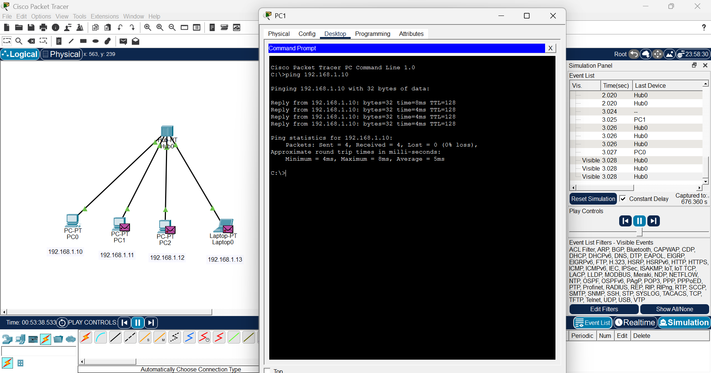

# 💻 Cisco Packet Tracer – Hub Network Simulation

Simulated a small network in **Cisco Packet Tracer** with 3 PCs and 1 Laptop connected through a **hub**, using static IP addresses and testing connectivity via `ping`.

## 📡 Key Observations
- **Hub behavior:** Broadcasts data to all devices → inefficient & insecure.  
- Modern alternatives like **switches** forward data only to intended recipients.  
- All devices could communicate, but traffic was visible to everyone.

## 📝 Key Takeaways
- Network devices directly affect **performance** and **security**.  
- Effective cybersecurity requires **multiple layers of protection**.  
- Replacing hubs with **switches or routers** improves both speed and security.

## 🖼️ Screenshot
Below is a screenshot of the network setup in Cisco Packet Tracer:  

  
*Figure: 3 PCs and 1 Laptop connected via a Hub, with static IPs configured.*

## 🚀 How to Explore
1. Open the simulation in **Cisco Packet Tracer**.  
2. Check IP settings for each device.  
3. Use **simulation mode** to see data broadcast behavior.  
4. Test connectivity using `ping`.

## 🔐 Conclusion
Even simple network exercises highlight **the importance of topology and device choice**. Hubs are easy to use but switches/routers are essential for real-world efficiency and security.
