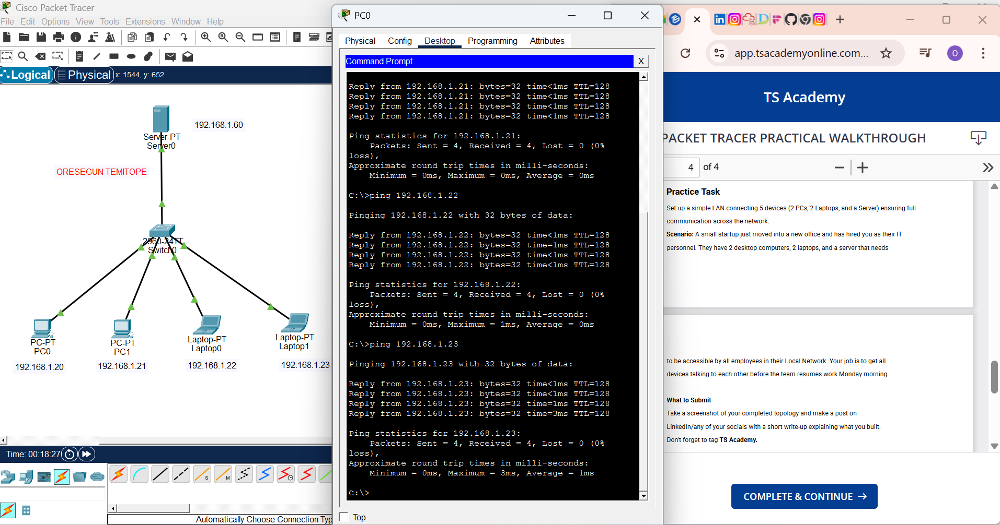

# Simple LAN Setup (Cisco Packet Tracer)

## 📌 Project Overview
This project demonstrates the design and configuration of a simple Local Area Network (LAN) using Cisco Packet Tracer. The goal was to connect multiple devices within a single network and ensure full communication between them.

## 🖥️ Network Devices
The network consists of:
- 2 Desktop PCs
- 2 Laptops
- 1 Server
- 1 Switch (Cisco 2960)

## 🌐 Network Design
All devices are connected to a central switch, forming a star topology. Each device is assigned a unique IP address within the same subnet.

### IP Addressing Scheme
| Device   | IP Address     | Subnet Mask     |
|----------|----------------|-----------------|
| PC0      | 192.168.1.20   | 255.255.255.0   |
| PC1      | 192.168.1.21   | 255.255.255.0   |
| Laptop0  | 192.168.1.22   | 255.255.255.0   |
| Laptop1  | 192.168.1.23   | 255.255.255.0   |
| Server   | 192.168.1.60   | 255.255.255.0   |

## 🔧 Configuration Details
- All devices were manually assigned IP addresses within the `192.168.1.0/24` network.
- A switch was used to enable communication between all connected devices.
- Proper cabling (Copper Straight-Through) was used for all connections.
- No router was required since all devices are within the same subnet.

## ✅ Testing & Verification
Connectivity was verified using the `ping` command:
- All devices successfully communicated with each other.
- 0% packet loss observed during testing.
- Network latency remained minimal (0–3 ms).

## 🎯 Outcome
- Full network connectivity achieved.
- Server is accessible by all devices in the network.
- Stable and efficient LAN communication established.

## 📚 Key Concepts Applied
- LAN design and topology (Star topology)
- IP addressing and subnetting
- Basic network troubleshooting
- Device-to-device communication using ICMP (ping)

## 📷 Screenshot

