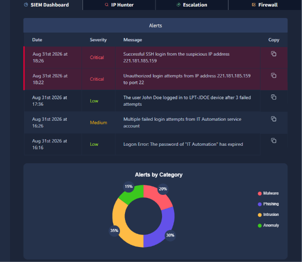
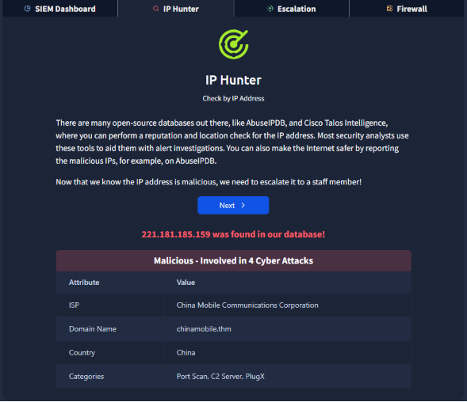
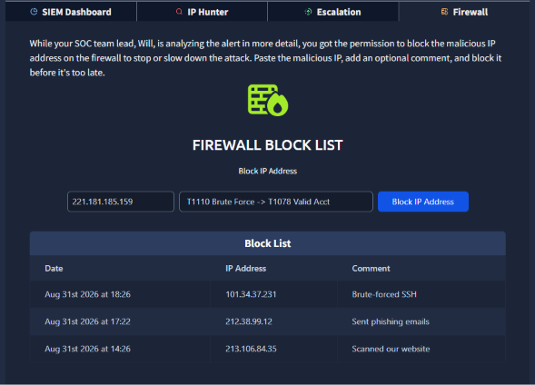

# [01] Junior Security Analyst Intro - TryHackMe SOC L1
**Handle:** oteejay96 | **Completed:** Aug 31, 2026 | **Room Type:** SOC L1 Triage Simulation

### Objective
Understand SOC Tier structure (L1/L2/L3), Blue Team workflow, and CIA triad in action.

### Live Triage Executed
1.  **MONITOR (SIEM):** Critical Alert - `Successful SSH login from suspicious IP 221.181.185.159` at 18:26 after failed attempts on port 22 at 18:22.
2.  **TRIAGE:** False Positive check -> John Doe 3 fails on LPT-JDOE = normal. True Positive -> same IP with failed then success = malicious pattern.
3.  **ENRICH (OSINT):** IP Hunter / AbuseIPDB: `Malicious - 4 Cyber Attacks | ISP: China Mobile | Categories: Port Scan, C2 Server, PlugX`
4.  **CONTAIN (Firewall):** Blocked `221.181.185.159` - Comment: `T1110 Brute Force -> T1078 Valid Acct`
5.  **ESCALATE:** Routed to SOC Team Lead (Will Griffin) - avoided mis-routing to HR/Admin.

### Framework Mapping
- **CIA Triad:** Confidentiality breach (unauthorized SSH) -> prevented Integrity loss & Availability loss (ransomware/lateral movement)
- **NIST CSF:** Detect (Alert) -> Respond (Enrich, Block, Escalate)
- **MITRE ATT&CK:** T1110 Brute Force, T1078 Valid Accounts, T1071 C2 (Initial Access Tactic)

### Key Takeaway for L1 Interview
Filtering 90% noise (normal user fails) to find 10% true positive (brute force -> success from known C2) and escalating with MITRE-mapped evidence is the core L1 job.

### Artifacts (Evidence)

