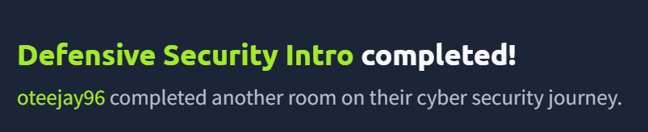

# Defensive Security Lab - TryHackMe

## Overview
Completed a Defensive Security lab on TryHackMe. Learned how Blue Teams protect networks by monitoring activity and responding to threats.

## Skills Learned
- Security monitoring
- Threat detection
- Incident response
- Blocking suspicious IP activity

## Lab Completion
Successfully completed the lab and Flag captured successfully ✅

## Screenshot

*Screenshot showing completion of the Defensive Security Intro lab.*
