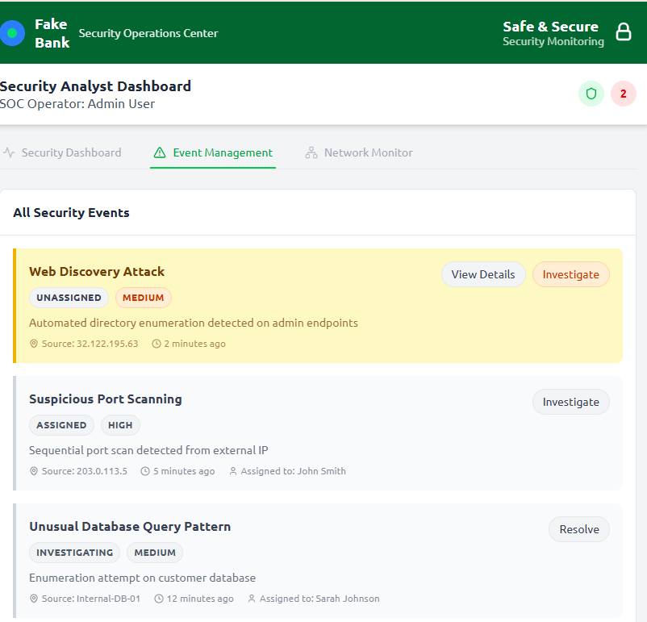
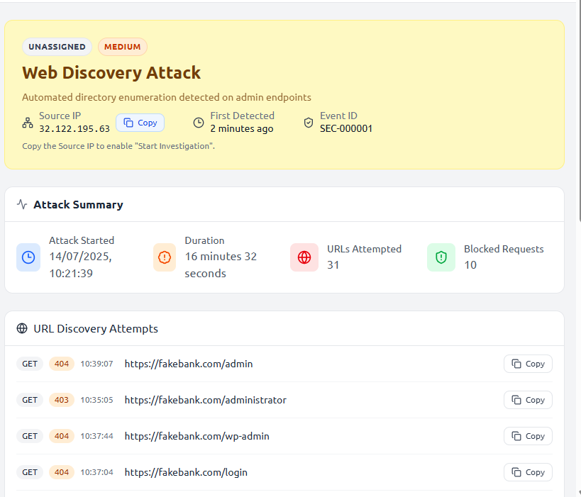
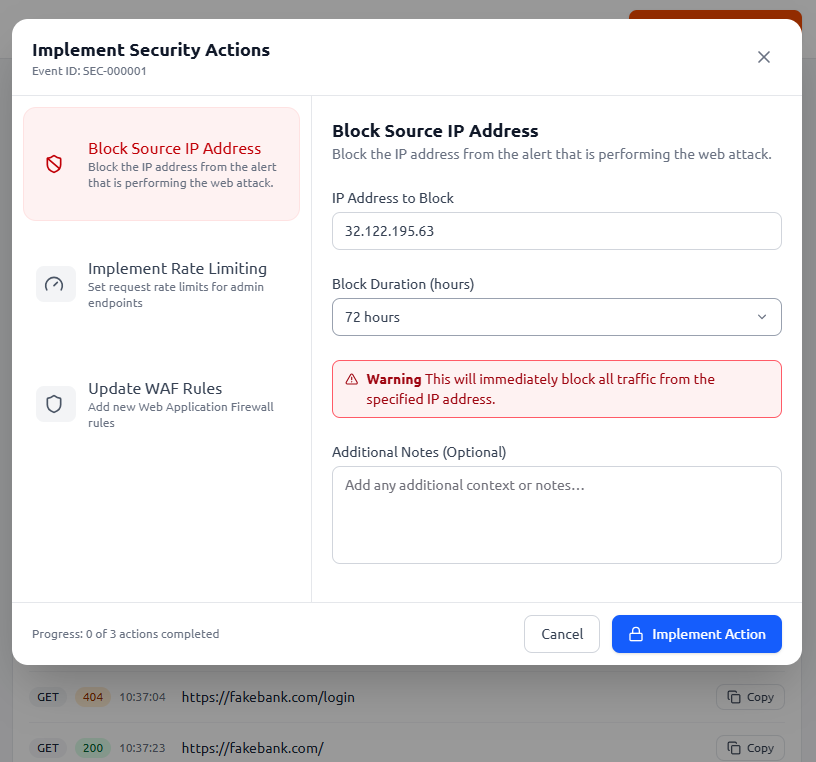
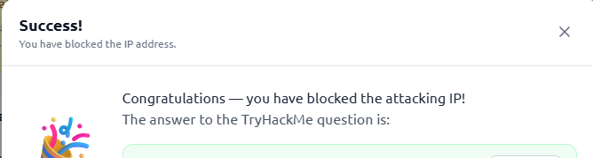

# Defensive Security (Blue Team) - TryHackMe Lab Notes

## Overview
Completed a **Defensive Security** lab on TryHackMe focused on understanding how **Blue Teams protect networks and organizations from cyber threats**.  
Defensive security plays a critical role in cybersecurity by monitoring systems, detecting suspicious activities and responding to potential attacks before they cause damage.

The lab demonstrated what **defensive security looks like in practice**, where security analysts monitor network activity and respond to threats in real time.

---

## What is Defensive Security?
**Defensive Security**, also known as **Blue Teaming**, focuses on protecting systems, networks and data from cyber attacks.

Unlike offensive security (red teaming), which attempts to exploit vulnerabilities, defensive security aims to **detect, prevent and respond to attacks**.

Organizations rely on defensive security teams to maintain the **confidentiality, integrity and availability of their systems**.

---

## Lab Activity
In this TryHackMe lab, a simulated security monitoring environment was provided to demonstrate how security analysts detect and respond to threats.

### Steps Performed
1. Accessed the defensive security monitoring dashboard.
2. Observed network activity displayed on the system radar.
3. Identified **suspicious activity coming from an attacker IP address**.
4. Investigated the abnormal behavior to confirm it was malicious.
5. **Blocked the attacker’s IP address** to prevent further access to the system.

---

## Responsibilities of Defensive Security Teams

### Monitoring and Detection
Security teams continuously monitor systems and networks to detect suspicious activity.

### Incident Response
Responding quickly to active threats by containing or stopping attacks.

### Threat Intelligence
Collecting and analyzing information about emerging cyber threats.

### Vulnerability Management
Identifying and fixing security weaknesses before attackers exploit them.

### Investigation and Analysis
Analyzing security incidents to understand how attacks occurred and how to prevent them.

---

## Skills Gained
- Security monitoring
- Threat detection
- Incident response basics
- Identifying malicious IP activity
- Understanding Blue Team responsibilities

---

## Lab Screenshot


---



---



---



---

*Monitoring the security dashboard and blocking a suspicious attacker IP during the TryHackMe defensive security lab.*

---

## Conclusion
This lab provided a practical introduction to **Defensive Security and Blue Team operations**, demonstrating how security teams detect threats and respond by blocking malicious activity to protect systems.
```
