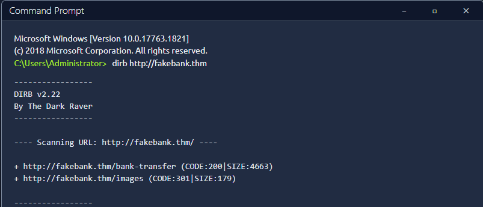

# Offensive Security Intro - TryHackMe

## Overview
Completed an Offensive Security lab on TryHackMe.  
This lab focused on practical attack techniques used in penetration testing and how vulnerabilities in web applications can be discovered and exploited.

## Key Concepts Learned
- Introduction to Offensive Security principles
- Enumeration techniques for discovering hidden resources
- Using the `dirb` tool to find hidden directories and pages
- Identifying sensitive information such as account numbers
- Exploiting a vulnerable admin page in a simulated banking environment

## Lab Activity
During the lab, a fake bank application was presented. The objective was to investigate the system and exploit weaknesses within the web application.

Steps performed during the exercise:
- Identified the **target bank account number** within the application
- Used the `dirb` command to enumerate hidden directories
- Discovered a hidden **/admin** page
- Accessed and exploited the admin functionality
- Successfully transferred money into the simulated bank account

#### Dirb Directory Enumeration

*Using dirb to enumerate hidden directories in the fake bank web application.*

## Lab Completion
Successfully completed the lab and Flag captured successfully ✅

## Screenshot

*Screenshot showing completion of the Offensive Security lab.*
