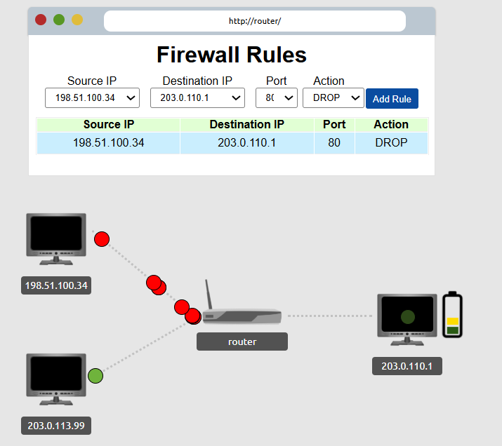
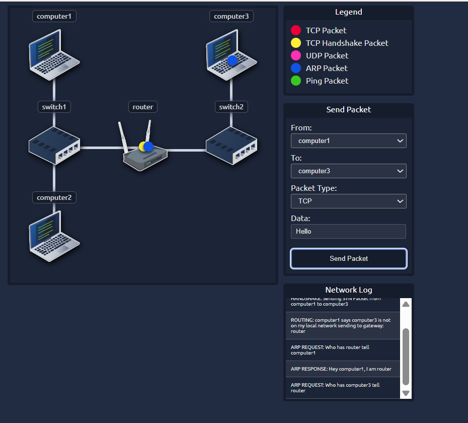

# 🌐 Extending Your Network – Notes

## 📌 Overview  
This lab expands on networking fundamentals and introduces key concepts used in real-world network security.

---

## 🔹 Port Forwarding  

Port forwarding allows external devices to access services on a private network.

- Maps public IP and port → private IP and port  
- Commonly configured on a **router**  

---

## 🔹 Intranet  

An **intranet** is a private network used within an organization.

- Restricted access  
- Used for internal communication and resource sharing  

---

## 🔥 Firewalls 101  

A **firewall** monitors and controls incoming and outgoing traffic using rules.

### 🔹 Packet Inspection Checks:
- Source (where traffic comes from)  
- Destination (where traffic is going)  
- Port number  
- Protocol (TCP, UDP, etc.)  

---

## 🔹 Firewall Categories  

### 1. Packet Filtering Firewall  
- Inspects individual packets  
- Operates at:
  - Layer 3 (Network)  
  - Layer 4 (Transport)  

---

### 2. Stateful Inspection Firewall  
- Inspects entire connections  
- Tracks session state  
- More secure than packet filtering  

---

### 3. Application Layer Firewall  
- Operates at:
  - Layer 7 (Application)  
- Inspects application data (e.g., HTTP traffic)  

---

## 🧪 Practical Firewall Task  

### Scenario:
- Malicious traffic → Red packets  
- Legitimate traffic → Green packets  
- Target server → `203.0.110.1`  
- Port to block → `80 (HTTP)`  

### ✅ Solution:
- Configure firewall rule to:
  - Block traffic on port 80  
  - Prevent malicious packets from reaching the server  

✔️ Flag successfully captured  

---

### 🖼️ Practical Firewall Task Screenshot  

---

## 🔐 VPN Basics  

A **Virtual Private Network (VPN)** enables secure communication over untrusted networks.

- Uses encrypted tunnels  
- Protects data and privacy  

---

### 🔹 Benefits  
- Secure communication  
- Data encryption  
- Remote access  
- Privacy protection  

---

### 🔹 VPN Technologies  

#### 1. PPP (Point-to-Point Protocol)  
- Provides encryption and authentication  

#### 2. PPTP (Point-to-Point Tunneling Protocol)  
- Allows PPP traffic to traverse networks  
- Faster but less secure  

#### 3. IPSec (Internet Protocol Security)  
- Uses IP framework  
- Provides strong encryption and authentication  

---

## 🖧 LAN Networking Devices  

### 🔹 Router  
- Connects networks  
- Performs routing  
- Operates at Layer 3  

---

### 🔹 Switch  
- Connects devices within a network  
- Operates at Layer 2 (and sometimes Layer 3)  

---

### 🔹 VLAN (Virtual Local Area Network)  
- Logical segmentation of networks  
- Improves:
  - Security  
  - Performance  
  - Network management  

---

## 🧪 Practical Network Simulator  

### Task:
- Send TCP packet from **Computer 1 → Computer 3**

### Process:
- Packet travels through switches and routers  
- Follows routing and OSI model steps  

✔️ Successfully completed and flag captured  

---

### 🖼️ Practical Network Simulator Screenshot  

---

## 📚 Key Takeaways  

- Port forwarding enables external access to internal services  
- Firewalls are critical for traffic filtering and security  
- VPNs ensure secure communication over public networks  
- Routers and switches are essential networking devices  
- VLANs improve network segmentation and efficiency  
- Practical labs reinforce networking concepts  

---

## ✅ Lab Completion  

- Status: Completed  
- All exercises finished successfully  
- Flags captured ✅

