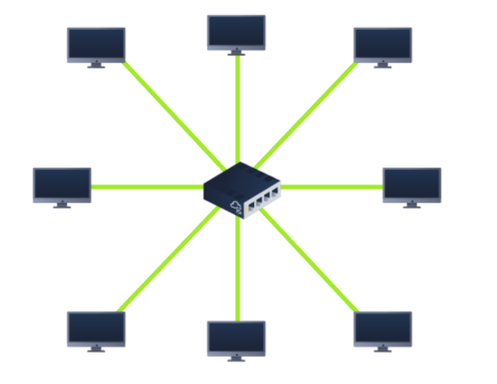
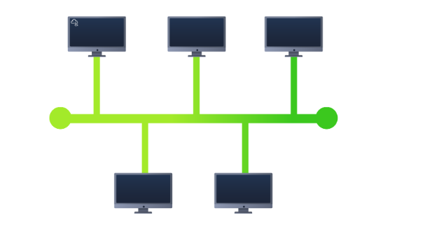
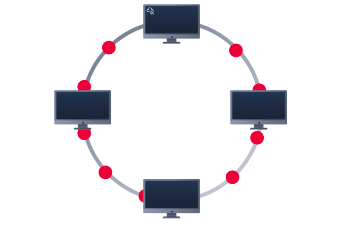
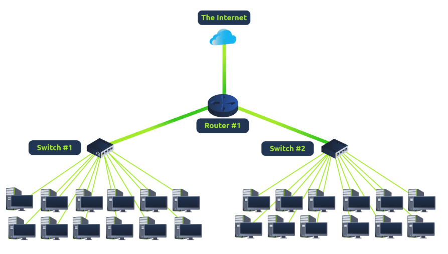
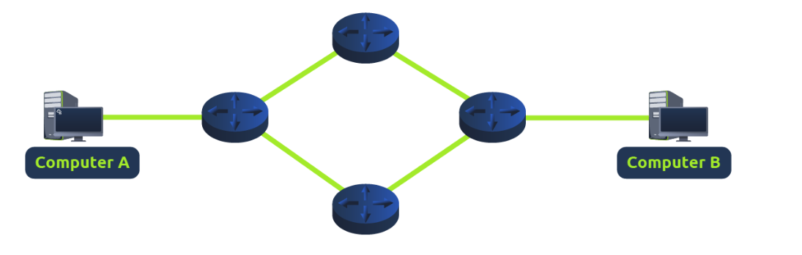
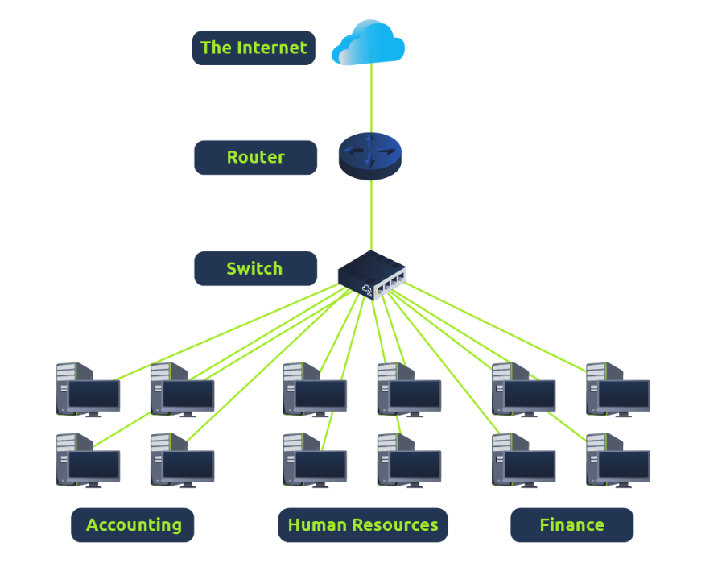
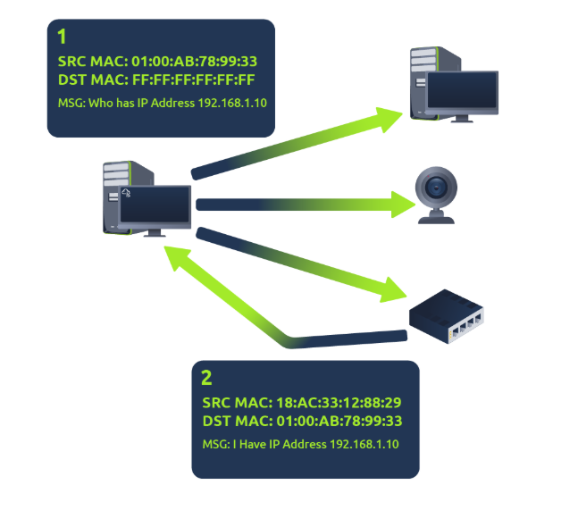
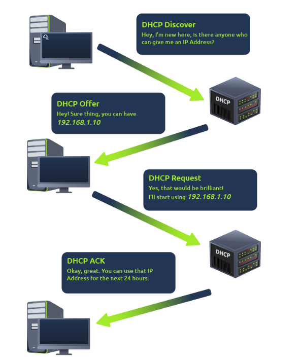

# Intro to Local Area Network (LAN) - TryHackMe Lab Notes

## Overview
This lab covered the fundamentals of **Local Area Network (LAN) topologies**, networking devices, **subnetting** and essential protocols like **ARP** and **DHCP**.  
Understanding these concepts is crucial for both **network administration** and **cybersecurity**, as they form the backbone of how devices communicate in a network.

---

## LAN Topologies
A **network topology** defines the layout and design of a network, including how devices are connected and how data flows between them.

### 1. Star Topology

- All devices are connected to a **central switch or hub**.  
- **Vulnerabilities:**  
  - Central device failure can bring down the entire network.  
  - Traffic bottlenecks may occur at the hub/switch.

### 2. Bus Topology

- Devices are connected along a **single backbone cable**.  
- **Vulnerabilities:**  
  - A break in the main cable disables the whole network.  
  - Difficult to isolate faults.  

### 3. Ring Topology

- Devices are connected in a **circular fashion**, each device connected to two neighbors.  
- **Vulnerabilities:**  
  - Failure of a single device or link can disrupt the entire network.  
  - Troubleshooting can be more complex.

---

## Networking Devices

### Switch
- Connects multiple devices on the same LAN.
- Uses **MAC addresses** to forward data only to the intended recipient.

---

### Router
- Connects different networks (LANs or WANs).
- Directs traffic between networks using **IP addresses**.

---

## Subnetting

**Subnetting** is the process of dividing a large network into smaller, manageable sub-networks (subnets).  
- Uses **subnet masks** represented as 32-bit numbers (four bytes: 0–255).  
- Benefits:
  - Improved **efficiency**
  - Enhanced **security**
  - Better **control over network traffic**

### How IP Addresses Are Used in Subnets
1. **Network Address:** Identifies the subnet itself.  
2. **Host Address:** Identifies individual devices within the subnet.  
3. **Default Gateway:** IP address of the router that connects the subnet to other networks.

---

## ARP (Address Resolution Protocol)
ARP is responsible for mapping **IP addresses to MAC addresses**, allowing devices to identify each other on a LAN.

### ARP Process
1. **ARP Request:** A device asks “Who has this IP?”  
2. **ARP Reply:** The device with that IP responds with its MAC address.  
3. **ARP Cache:** Devices store IP-to-MAC mappings to reduce repeated queries.

#### ARP Demonstration
  
*Instance image showing ARP request and reply.*

---

## DHCP (Dynamic Host Configuration Protocol)
DHCP is used to **automatically assign IP addresses** to devices on a network.

### DHCP Process
1. **DHCP Discover:** Client broadcasts to find available DHCP servers.  
2. **DHCP Offer:** Server responds with an IP address offer.  
3. **DHCP Request:** Client requests the offered IP address.  
4. **DHCP Acknowledgment (Ack):** Server confirms the assignment.

#### DHCP Demonstration
  
*Instance image showing DHCP discover, offer, request and acknowledgment flow.*

---

## Summary
This lab reinforced foundational networking concepts:
- LAN topologies and their vulnerabilities  
- Core network devices: **Switch** and **Router**  
- Subnetting for network efficiency, security, and control  
- ARP for IP-MAC address resolution  
- DHCP for dynamic IP address assignment  

Understanding these concepts is critical for **network administration** and forms a strong basis for **cybersecurity learning**.
