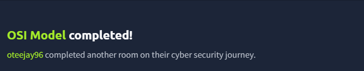

# OSI Model - TryHackMe

## Overview
Completed a TryHackMe lab covering the **OSI (Open Systems Interconnection) Model** and how data moves through the seven layers of network communication.

## Topics Covered
- The 7 layers of the OSI model
- TCP vs UDP
- Network routing concepts
- Encapsulation

## Skills Learned
- Understanding network communication layers
- Identifying protocols at different OSI layers
- Applying OSI concepts in networking and cybersecurity

## Lab Activity
Completed an interactive game where the correct OSI layers had to be selected in order to pass through doors representing each layer.

## Lab Completion
Successfully completed the lab and Flag captured successfully ✅

## Screenshot

*Screenshot showing lab completion.*
