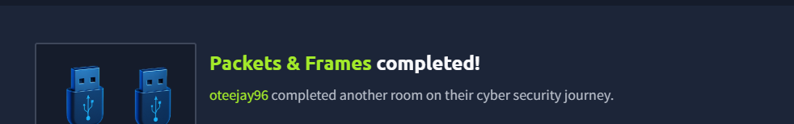

# 🌐 Packets & Frames – TryHackMe Lab

## 📌 Overview
Completed a lab focused on **Transport Layer protocols**, specifically **TCP** and **UDP**, including how data is transmitted using packets and frames.

The lab also covered the **TCP three-way handshake**, protocol headers, and practical exercises involving packet analysis and port interaction.

---

## 🧠 Skills Learned
- Understanding **Packets (Layer 3)** and **Frames (Layer 2)**
- TCP/IP communication and the **three-way handshake**
- TCP vs UDP (advantages and disadvantages)
- TCP & UDP **headers and structure**
- **Port interaction** and network communication
- Packet analysis during practical labs

---

## 🔍 Key Concepts

### 📦 Packets vs Frames
- **Packet (Layer 3 – Network Layer):** Contains IP address information  
- **Frame (Layer 2 – Data Link Layer):** Encapsulated data used for local delivery  

---

### 🤝 TCP (Transmission Control Protocol)
- Connection-oriented protocol  
- Uses **three-way handshake**:
  1. SYN  
  2. SYN-ACK  
  3. ACK  

---

### ⚡ UDP (User Datagram Protocol)
- Connectionless (stateless) protocol  
- Faster but less reliable than TCP  

---

## 🧪 Lab Outcome
- ✅ Successfully analyzed TCP handshake  
- ✅ Completed practical on ports and UDP communication  
- 🚩 Flags captured successfully  

---

## Badge

*Screenshot showing completion of the "What is Networking?" lab.*

---

## 🚀 Key Takeaways
- Clear understanding of **TCP vs UDP behavior**
- Learned how **network communication is established and maintained**
- Gained hands-on experience with **packet flow and port interaction**
