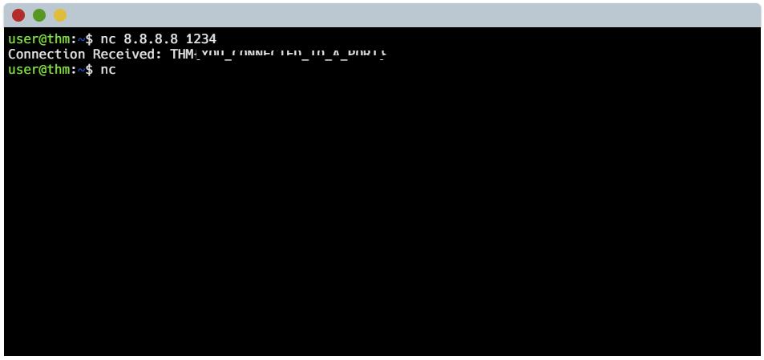

# 🌐 Packets & Frames – Lab Notes

## 📌 Overview
This lab explores **Transport Layer protocols** in the TCP/IP model, focusing on **TCP (Transmission Control Protocol)** and **UDP (User Datagram Protocol)**.

It also covers how data is structured and transmitted using **Packets (Layer 3)** and **Frames (Layer 2)**, along with practical exercises involving **handshakes, ports, and packet analysis**.

---

## 📦 Packets vs Frames

### 🧩 Packet (Layer 3 – Network Layer)
- A **packet** is a unit of data used for communication across networks.
- Contains:
  - **Source IP Address**
  - **Destination IP Address**
  - Payload (data)

✅ Responsible for **logical addressing and routing**

---

### 🧱 Frame (Layer 2 – Data Link Layer)
- A **frame** encapsulates a packet for transmission within a local network.
- Contains:
  - **Source MAC Address**
  - **Destination MAC Address**
  - Payload (packet)

✅ Responsible for **physical delivery within a LAN**

---

## 🤝 TCP (Transmission Control Protocol)

### 📖 Description
TCP is a **connection-oriented and reliable protocol** used to ensure accurate data delivery between devices.

It guarantees:
- Data arrives **in order**
- Data is **not lost or duplicated**

---

## 🔄 TCP Three-Way Handshake

The handshake establishes a reliable connection before data transfer.

### Step 1: SYN
- Client sends a **SYN (synchronize)** packet
- Indicates the initial sequence number

### Step 2: SYN-ACK
- Server responds with:
  - **SYN** (its own sequence number)
  - **ACK** (acknowledging client’s SYN)

### Step 3: ACK
- Client sends **ACK**
- Connection is established

✅ Communication can now begin

---

## 📊 TCP Header (Detailed Explanation)

The **TCP header** contains control information required for reliable communication.

### Key Fields:

- **Source Port (16 bits)**
  - Identifies sending application

- **Destination Port (16 bits)**
  - Identifies receiving application

- **Sequence Number (32 bits)**
  - Tracks the order of bytes sent

- **Acknowledgment Number (32 bits)**
  - Confirms received data

- **Data Offset (Header Length)**
  - Indicates size of TCP header

- **Flags (Control Bits)**
  - **SYN** → Start connection  
  - **ACK** → Acknowledgment  
  - **FIN** → Terminate connection  
  - **RST** → Reset connection  
  - **PSH** → Push data immediately  
  - **URG** → Urgent data  

- **Window Size**
  - Controls flow of data (flow control)

- **Checksum**
  - Error-checking mechanism

- **Urgent Pointer**
  - Points to urgent data (if URG flag is set)

---

## ✅ Advantages of TCP
- Reliable data delivery  
- Error detection and correction  
- Ordered data transmission  
- Flow control and congestion control  

---

## ❌ Disadvantages of TCP
- Slower due to overhead  
- Requires connection setup (handshake)  
- Higher resource consumption  

---

## 🧪 Practical: TCP Handshake & Capture the Flag
- Identified:
  - SYN → SYN-ACK → ACK sequence
- Successfully captured the flag  

---

## ⚡ UDP (User Datagram Protocol)

### 📖 Description
UDP is a **connectionless and stateless protocol**.

- No handshake required  
- Data is sent immediately  
- No guarantee of delivery  

---

## 📊 UDP Header (Detailed Explanation)

The **UDP header** is simpler than TCP, with minimal overhead.

### Key Fields:

- **Source Port (16 bits)**
  - Identifies sending application

- **Destination Port (16 bits)**
  - Identifies receiving application

- **Length (16 bits)**
  - Total size of UDP header + data

- **Checksum (16 bits)**
  - Error detection (optional in some cases)

---

## ✅ Advantages of UDP
- Faster transmission  
- Low latency  
- Minimal overhead  
- Suitable for real-time applications (e.g., streaming, VoIP, gaming)

---

## ❌ Disadvantages of UDP
- No reliability (packets may be lost)  
- No acknowledgment system  
- No ordering of packets  
- No congestion control  

---

## 🔌 Ports and Their Role

- Ports identify **specific services/applications** on a device  
- Used by both TCP and UDP  

### Examples:
- Port 80 → HTTP  
- Port 443 → HTTPS  
- Port 53 → DNS  

---

## 🧪 Practical: Port & Capture the Flag

*Successfully captured the flag*

---

## 🧾 Summary

This lab provided a deep understanding of:

- Differences between **Packets (Layer 3)** and **Frames (Layer 2)**  
- TCP as a **reliable, connection-oriented protocol**  
- UDP as a **fast, stateless protocol**  
- Detailed structure of **TCP and UDP headers**  
- Importance of **ports in network communication**  

💡 These concepts are essential for:
- Network troubleshooting  
- Packet analysis 
- Penetration testing  
- Cybersecurity fundamentals  
