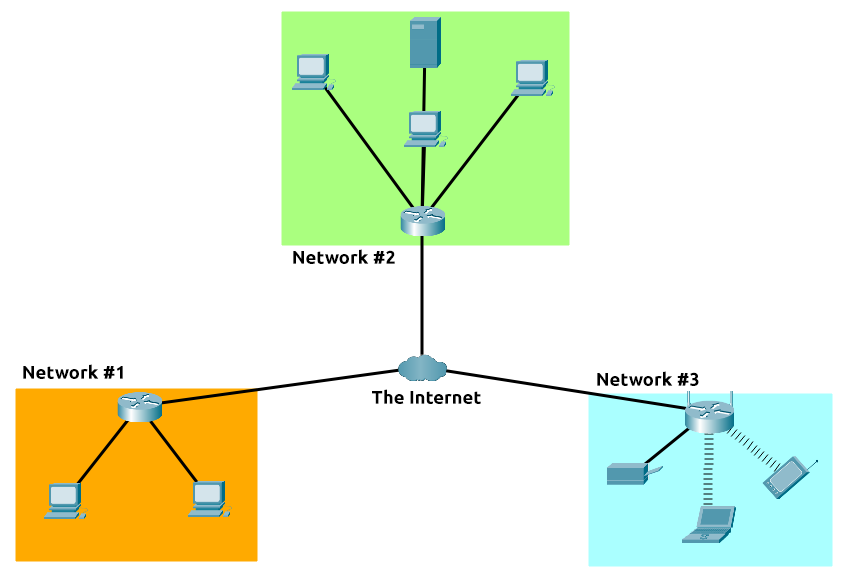
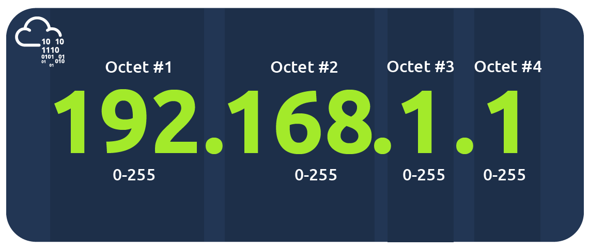
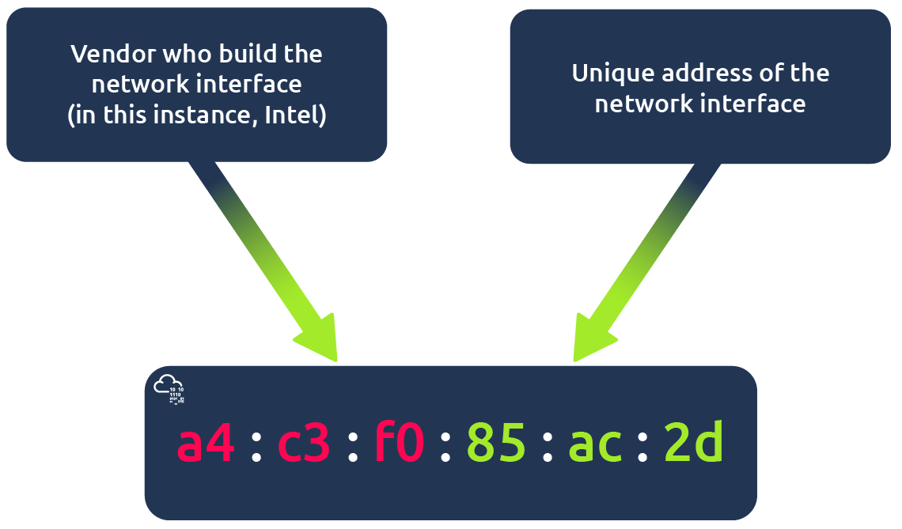

# What is Networking? – Notes

## Overview
This lab introduces the fundamentals of **networking** and why it is essential for cybersecurity.  
A network is a group of devices connected to communicate and share information. The **internet** is the largest network, made up of smaller **private networks** connected through a **public network**.  

The **World Wide Web (WWW)**, introduced by **Tim Berners-Lee in 1989**, made the internet more accessible for people worldwide.

---

## Internet Connecting Multiple Private Networks



**Explanation:**  
Multiple private networks (Network #1, Network #2, Network #3) connect to the internet through routers. Each private network contains devices like computers, servers, and mobile devices. The internet acts as a bridge allowing communication between these networks globally.

---

## Device Identification on a Network

Devices are identified using **IP addresses** and **MAC addresses**.

### 1. IP Address (Internet Protocol)

- **Digital address** allowing devices to locate and communicate.
- **Private IP:** Used within a local network.  
- **Public IP:** Assigned by an ISP for internet communication.  
- **Versions:** IPv4 and IPv6.

#### IPv4 Example

  

- Four octets (0–255)  
- Example: 192.168.1.1  

---

### 2. MAC Address (Media Access Control)

- Unique hardware identifier for a network interface.  
- **First 6 characters** → Vendor (OUI)  
- **Last 6 characters** → Unique device ID  

#### MAC Address Structure

  

**MAC Spoofing:**  
- MAC addresses can be **spoofed** to bypass network restrictions.  
- Lab exercise demonstrated how spoofing can potentially gain access to a network.

---

## Practical Exercise – Ping Test

**Ping** is used to test connectivity and measure network response. It sends **ICMP packets** to the target host.

### Command

```bash
ping -c 4 8.8.8.8

```

Explanation:

-c 4 → Send 4 packets

Target → Google DNS 8.8.8.8

All packets received → 0% packet loss → Connectivity confirmed

Flag Captured: THM{I_PINGED_THE_SERVER} ✅

## Key Takeaways

- Networking fundamentals are critical for cybersecurity.  
- Devices are identified using **IP** and **MAC addresses**.  
- Understanding networks helps detect vulnerabilities and potential attacks.  
- Tools like `ping` allow for basic network diagnostics.  
- Practical exercises reinforce theoretical concepts.

## Lab Completion

**Status:** ✅ Completed

This lab strengthens the foundation for understanding networks, a crucial aspect of cybersecurity.
