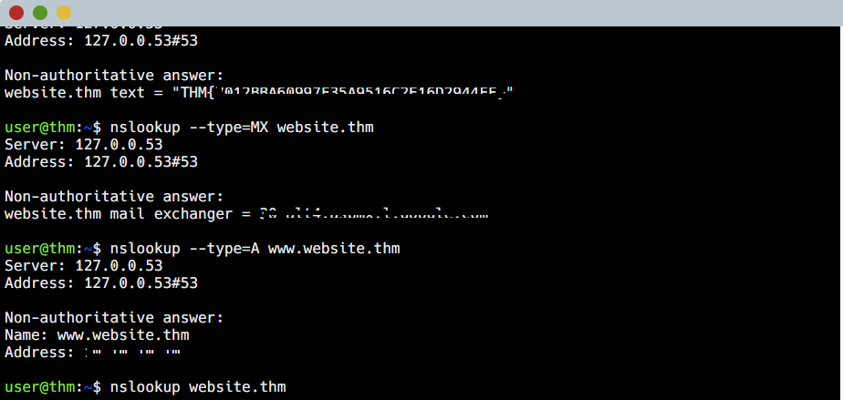
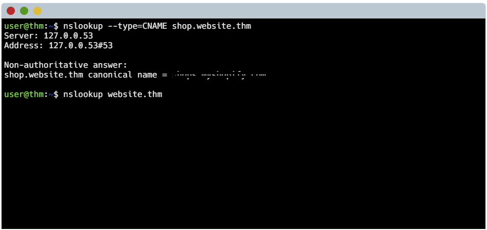
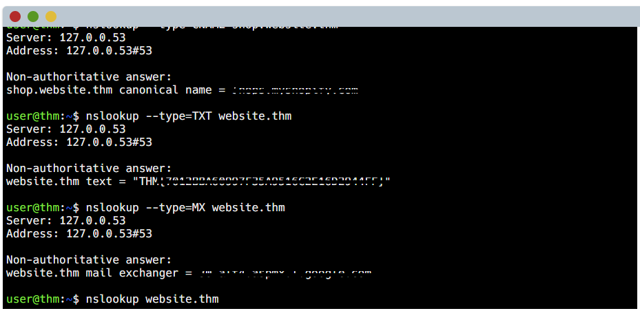
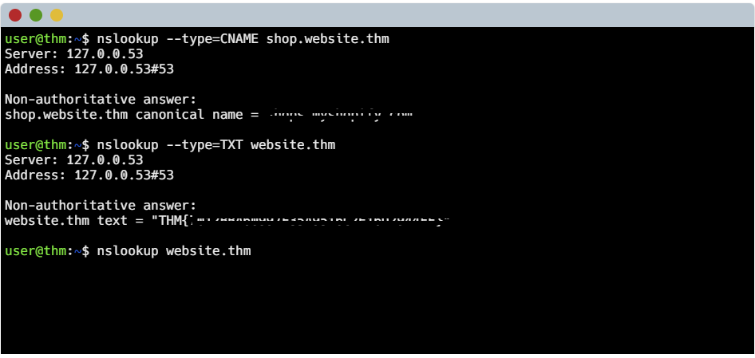

# 🌐 DNS in Detail – Notes (TryHackMe)

## 📌 Overview
The **Domain Name System (DNS)** converts domain names into IP addresses, allowing communication across networks.

---

## 🏗️ Domain Hierarchy

### Root Domain (.)
Top-level of DNS hierarchy  

### TLD (Top-Level Domain)
- gTLD: .com, .org, .net  
- ccTLD: .ng, .uk, .us  

### Second-Level Domain (SLD)
- Example: `example` in example.com  

### Subdomain
- Example: `www.example.com`  www is the subdomain

#### Rules:
- Max subdomain length: 63 characters  
- Max domain length: 253 characters  
- No underscores in hostnames
- No hyphens beginning or at the end of characters

---

## 📄 DNS Record Types

### A Record
Maps domain → IPv4  

example.com → 192.168.1.1

---

### AAAA Record
Maps domain → IPv6  

example.com → 2001:db8::1

---

### CNAME Record
Alias of another domain  

www.example.com → example.com

---

### MX Record
Mail routing  

example.com → mail.example.com (priority 10)

---

### TXT Record
Stores text data (SPF, verification)  

v=spf1 include:_spf.google.com ~all

---

## 🔄 DNS Resolution Process

1. Client checks cache  
2. Query sent to Recursive Resolver  
3. Resolver queries Root Server  
4. Root → TLD Server  
5. TLD → Authoritative Server  
6. IP returned to client  

---

## ⏱️ TTL (Time To Live)

Defines how long records are cached  

TTL = 3600 seconds

### Trade-off:
- High TTL → faster performance  
- Low TTL → quicker updates  

---

# 🧪 Practical Section

## 🔹 1. A Record

### 📸 Screenshot

---

## 🔹 2. CNAME Record

### 📸 Screenshot

---

## 🔹 3. MX Record

### 📸 Screenshot

---

## 🔹 4. TXT Record

### 📸 Screenshot

---

## 🧠 Key Takeaways

- DNS translates domain names into IP addresses  
- DNS hierarchy ensures scalability  
- Each record type has a specific role  
- TTL controls caching behavior  
- Practical DNS skills are essential in cybersecurity  

---

## ✅ Lab Completion

Status: ✅ Completed  

This lab strengthens foundational knowledge of DNS, which is essential for networking and cybersecurity.

