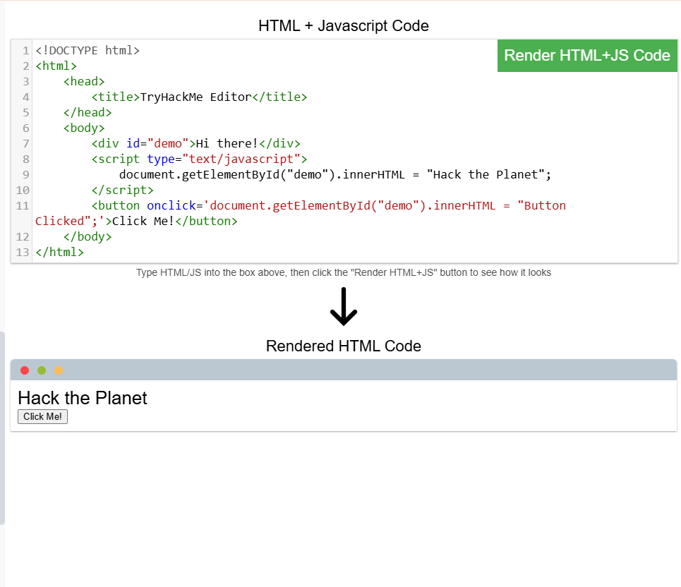

# 🌐 How Websites Work – TryHackMe

## 📌 Overview
This project explores the fundamentals of how websites function, focusing on **frontend (client-side)** and **backend (server-side)** components, core web technologies, and basic web security concepts.

---

## 🧠 Key Skills Learned
- Understanding **frontend vs backend architecture**  
- Working with **HTML, CSS, and JavaScript**  
- Analyzing how web pages are structured and behave  
- Identifying common **web vulnerabilities**  

---

## 🧪 Practical Work

### 🔹 HTML Structure & Image Handling
- Fixed incomplete HTML structure  
- Inserted images using `` tag  

📸  

---

### 🔹 JavaScript Interaction
- Displayed dynamic content (**"Hack the Planet"**)  
- Created an interactive button  

📸  

---

### 🔹 Sensitive Data Exposure
- Discovered exposed credentials in page source  
- Demonstrated risks of improper data handling  

📸  

---

### 🔹 HTML Injection
- Injected HTML into input fields  
- Rendered clickable link on the page  

📸  

---

## 🔐 Security Insights
- Sensitive data should never be exposed in frontend code  
- Input validation is essential to prevent injection attacks  
- Poor security practices can lead to serious vulnerabilities  

---

## 🚀 Why This Matters
This lab builds a strong foundation in:
- Web development fundamentals  
- Cybersecurity and web application security  
- Identifying real-world vulnerabilities  

---

## 📚 Detailed Notes
👉 See `notes.md` for full breakdown and explanations  

---

## 🔹 Practical Lab Completion

