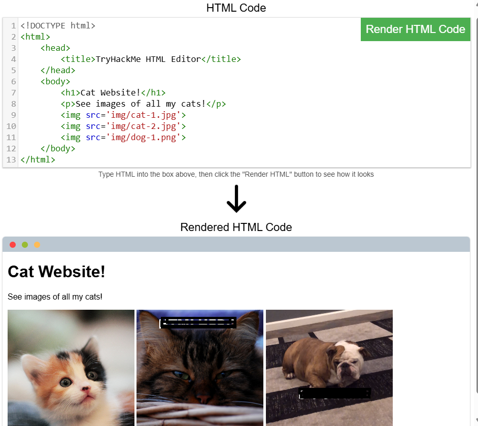
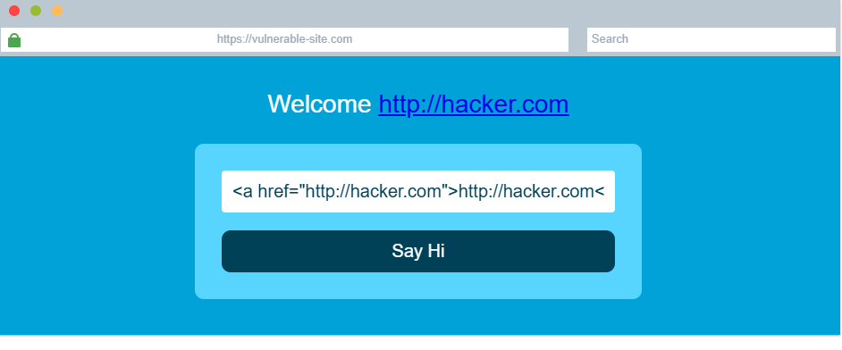

# 🌐 How Websites Work – Notes (TryHackMe)

## 📌 Overview
Websites are built using a combination of technologies that work together to deliver content and functionality to users.

There are two major components that make up a website:

---

## 🏗️ Website Components

### 🔹 Front-End (Client-Side)
- The part of the website users interact with directly  
- Runs in the browser  
- Built using:
  - HTML  
  - CSS  
  - JavaScript  

---

### 🔹 Back-End (Server-Side)
- Handles logic, databases, and server operations  
- Processes requests from the client  
- Sends responses back to the browser  

---

## 💻 Core Web Technologies

### 🔹 HTML (HyperText Markup Language)
- The foundation of all web pages  
- Defines structure and content  

---

### 🔹 CSS (Cascading Style Sheets)
- Controls the visual appearance  
- Handles layout, colors, fonts  

---

### 🔹 JavaScript
- Adds interactivity to web pages  
- Controls behavior and dynamic content  

---

## 🧱 HTML Structure

A basic HTML document includes:

```html
<!DOCTYPE html>
<html>
<head>
    <title>Page Title</title>
</head>
<body>
    <h1>Heading</h1>
    <p>Paragraph</p>
</body>
</html>

```
## Key Elements
- DOCTYPE → Defines document type
- html → Root element
- head → Metadata (title, scripts)
- body → Visible content
- h1 → Heading
- p → Paragraph

---

## Common Tags
- </button/> → Button element
- </img/> → Image
- src → Image source attribute

---

## 🧪 Practical: HTML Fix & Image Insertion

#### 📌 Task:
- Fix incomplete HTML structure
- Insert an image correctly

## 📸 Screenshot


---

## ⚡ JavaScript

JavaScript makes web pages interactive and dynamic.

- HTML → Structure
- CSS → Styling
- JavaScript → Functionality

---
## 🧪 Practical: JavaScript

#### 📌 Task:

- Display text: "Hack the Planet"
- Create a button: "Click Me"

---

## 📸 Screenshot


---
## ⚠️ Sensitive Data Exposure

Sensitive data exposure occurs when:

- A website exposes sensitive information
- Data is visible in frontend/source code
- No proper protection is applied

---
## 🧪 Practical: Sensitive Data Exposure

#### 📌 Task:
- Enter incorrect login credentials
- View page source
- Identify exposed credentials

---
## 🔍 Observation:

- Correct login details were visible in the source code
- Used those details to log in successfully

---
## 📸 Screenshot


---

## 💉 HTML Injection

HTML Injection occurs when:

- User input is not filtered
- Malicious HTML is rendered on the page

---

## 🧪 Practical: HTML Injection
#### 📌 Task:

- Inject HTML into an input field

---

## ✅ Payload Used:

</a href="http://tryhackme.com">http://tryhackme.com</a/>

---

## 🔍 Result:
- The link was displayed on the page
- Shows lack of input validation
---

## 📸 Screenshot


---

## 🧼 Input Sanitization

Input sanitization is the process of:

- Filtering user input
- Preventing malicious code execution

---

## 🔐 Importance:
- Prevents HTML Injection
- Improves application security

---

## 🧠 Key Takeaways
- Websites consist of frontend and backend components
- HTML, CSS, and JavaScript are core technologies
- JavaScript enables interactivity
- Sensitive data should never be exposed in source code
- Input validation is critical for security
- HTML Injection is a common vulnerability

---

## ✅ Lab Completion

Status: ✅ Completed

This lab provides foundational knowledge of how websites work and introduces basic web security concepts.
