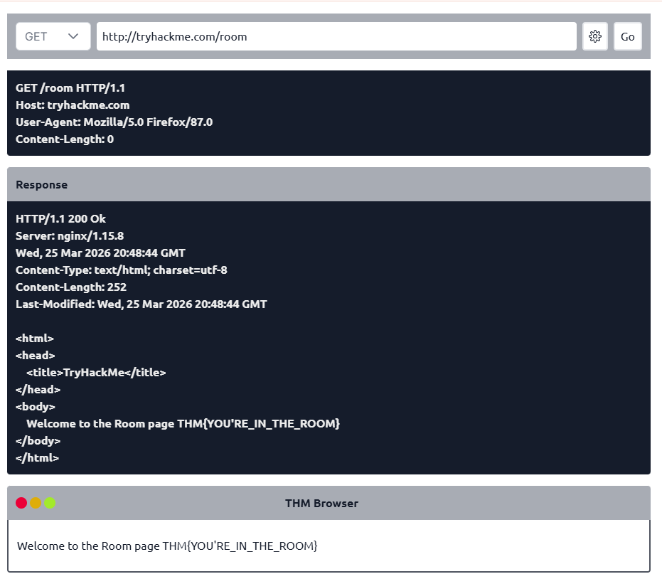
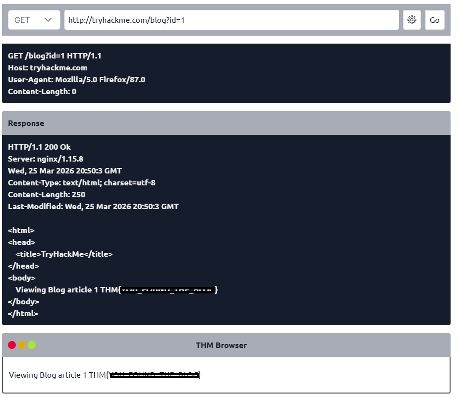
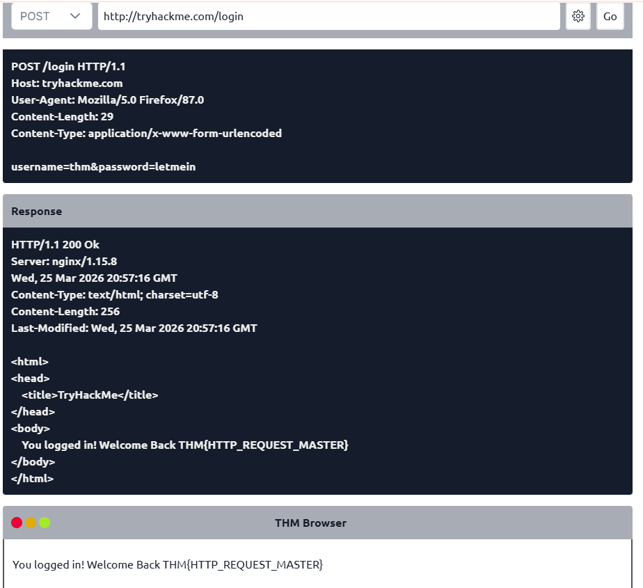
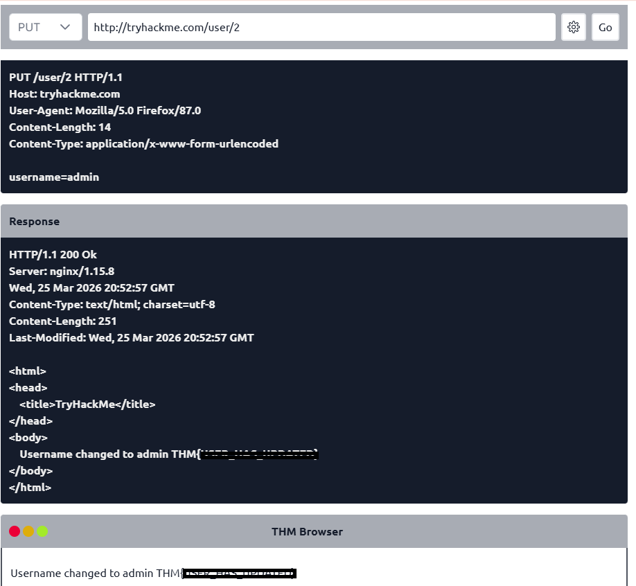
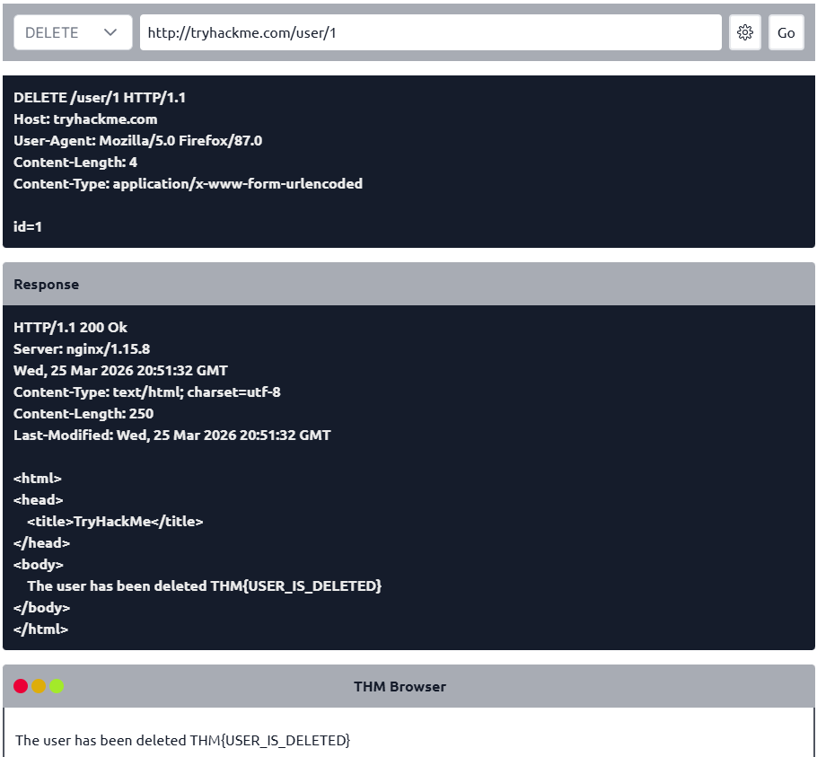

# 🌐 HTTP in Detail – Notes (TryHackMe)

## 📌 Overview
HTTP (HyperText Transfer Protocol) is used for communication between clients (browsers) and web servers.

HTTPS is the secure version, using encryption (TLS/SSL) to protect data in transit.

---

## 🔐 HTTP vs HTTPS

### 🔹 HTTP
- Data sent in plain text  
- Vulnerable to interception (e.g., MITM attacks)  

### 🔹 HTTPS
- Data is encrypted  
- Secure communication  

### ⚠️ Practical Observation:
- “Not Secure” or crossed padlock = insecure connection  
- Clicking it reveals certificate/security issues  

---

## 🔗 URL Structure

scheme://user@host:port/path?query#fragment

### Components:

- **Scheme:** http / https  
- **User:** optional authentication info  
- **Host:** domain (e.g., tryhackme.com)  
- **Port:** default 80 (HTTP), 443 (HTTPS)  
- **Path:** resource location  
- **Query String:** parameters (?id=1)  
- **Fragment:** section of page (#top)  

---

## 📤 HTTP Request Example

GET / HTTP/1.1
Host: tryhackme.com
User-Agent: Mozilla/5.0 Firefox/87.0
Referer: https://tryhackme.com

---

## 📥 HTTP Response Example

HTTP/1.1 200 OK
Server: nginx/1.15.8
Content-Type: text/html
Content-Length: 98

---

## 🧰 HTTP Methods (Practical)

---

## 🔹 1. GET Request

Used to retrieve data from the server.

### 📌 Example:

GET / HTTP/1.1

### 📸 Screenshot

---

## 🔹 2. GET Request with Parameter

Used to retrieve specific data using query parameters.

### 📌 Example:

GET /user?id=1 HTTP/1.1

### 📸 Screenshot

---

## 🔹 3. POST Request

Used to send data to the server (e.g., login forms).

### 📌 Example:

POST /login HTTP/1.1

username=admin&password=1234

### 📸 Screenshot

---

## 🔹 4. PUT Request

Used to update or create a resource.

### 📌 Example:

PUT /user HTTP/1.1

username=admin

### 📸 Screenshot

---

## 🔹 5. DELETE Request

Used to remove a resource from the server.

### 📌 Example:

DELETE /user/1 HTTP/1.1

### 📸 Screenshot

---

## 📊 HTTP Status Codes

### Categories:

- **100–199** → Informational  
- **200–299** → Success  
- **300–399** → Redirection  
- **400–499** → Client Errors  
- **500–599** → Server Errors  

---

### Common Codes:

- **200 OK**  
- **201 Created**  
- **301 Moved Permanently**  
- **302 Found**  
- **400 Bad Request**  
- **401 Unauthorized**  
- **403 Forbidden**  
- **404 Not Found**  
- **405 Method Not Allowed**  
- **500 Internal Server Error**  
- **503 Service Unavailable**  

---

## 🧾 Headers

### 🔹 Request Headers
- Host  
- User-Agent  
- Content-Length  
- Accept-Encoding  
- Cookie  

---

### 🔹 Response Headers
- Set-Cookie  
- Cache-Control  
- Content-Type  
- Content-Encoding  

---

## 🍪 Cookies

- Stored in the browser  
- Sent with every request  

### Uses:
- Authentication (sessions)  
- Tracking  
- Personalization  

---

## 🔐 Security Insight

- HTTP traffic can be intercepted  
- Sensitive data (cookies, credentials) may be exposed  
- Common attack vectors:
  - Session hijacking  
  - Parameter tampering  
  - Credential interception  

---

## 🧠 Key Takeaways

- HTTP powers web communication  
- HTTPS secures data with encryption  
- Requests and responses are fundamental  
- Each HTTP method has a specific purpose  
- Headers and cookies manage sessions and data  

---

## ✅ Lab Completion

**Status:** ✅ Completed  

This lab builds foundational knowledge for web security and penetration testing.
