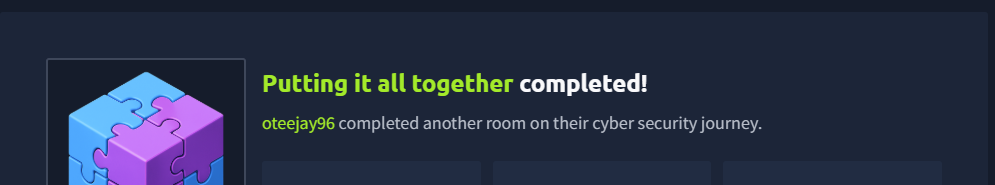

# 🌐 Putting It All Together – TryHackMe

## 📌 Overview
This project summarizes how websites work end-to-end — from entering a URL in a browser to rendering a fully loaded webpage.

It combines concepts from DNS, HTTP, and web infrastructure to show how different components interact to deliver web content.

---

## 🧠 Key Skills Learned
- Understanding the **full website request lifecycle**  
- How **DNS resolves domain names to IP addresses**  
- Role of **WAF, Load Balancers, and CDNs**  
- How web servers and databases interact  
- Difference between **static and dynamic content**  

---

## 🔄 Website Request Flow
- Browser requests a website  
- DNS resolves the domain to an IP address  
- Request passes through **WAF and Load Balancer**  
- Web server processes the request  
- Application interacts with the **database**  
- Server responds with content  
- Browser renders the webpage  

---

## ⚙️ Key Components

- **Load Balancer** → Distributes traffic and ensures availability  
- **CDN** → Improves performance by caching content  
- **Database** → Stores and retrieves application data  
- **WAF** → Protects against malicious traffic  
- **Web Server** → Handles HTTP requests (e.g., Apache, Nginx)  

---

## 🧪 Practical Work
- Arranged the correct sequence of a website request flow  
- Demonstrated understanding of how web components interact  
- Successfully completed the lab challenge  

---

## 📸 Lab Completion

---

## 🚀 Why This Matters
This lab builds a complete understanding of:
- Web architecture  
- Network communication  
- Cybersecurity fundamentals  

---

## 📚 Detailed Notes
👉 See `notes.md` for full breakdown  

---

## ✅ Status
✔️ Completed
