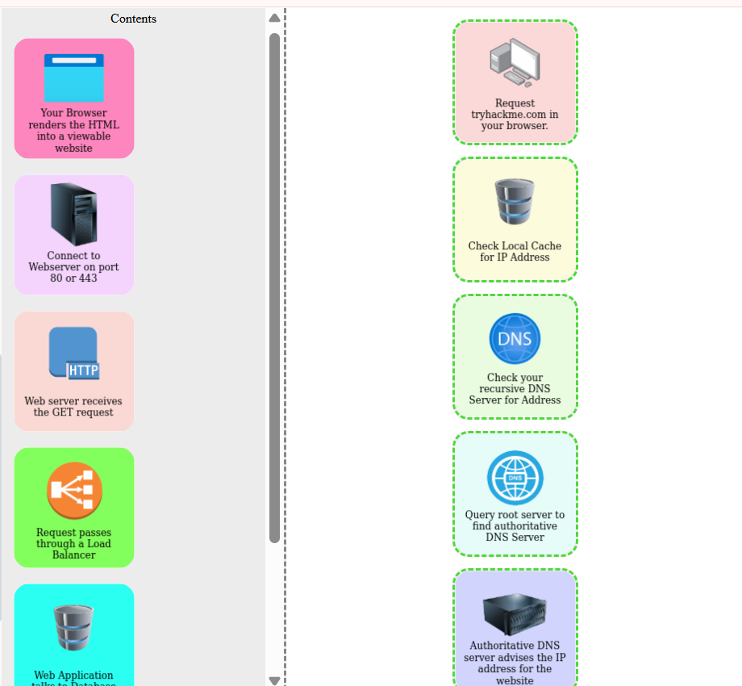
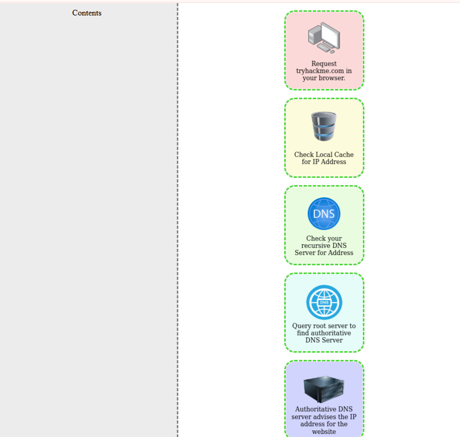
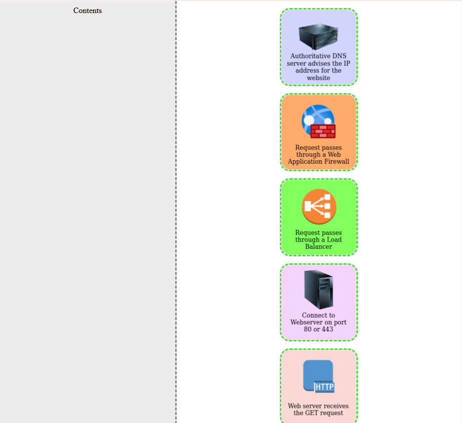
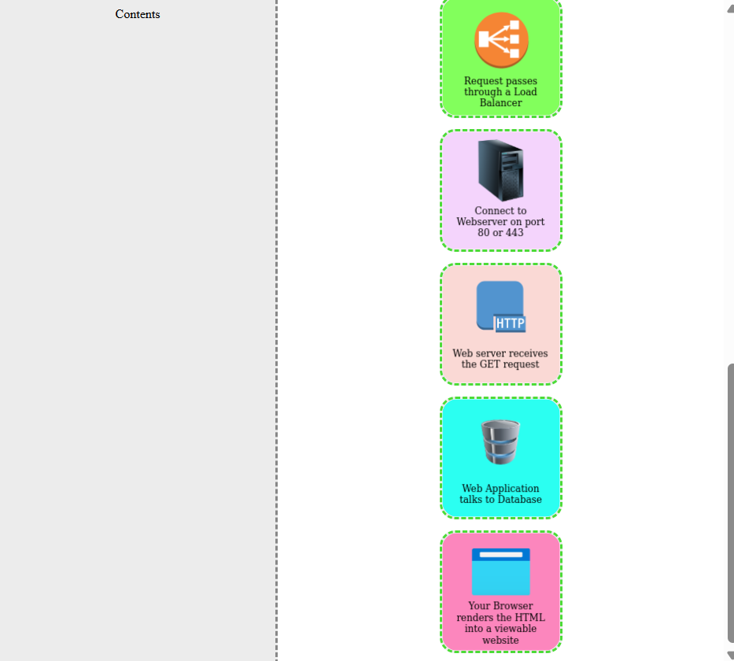

# 🌐 Putting It All Together – Notes (TryHackMe)

## 📌 Overview
This lab summarizes how all web components work together when a user requests a website from a browser.

It explains how a request travels from the browser through DNS, security layers, and servers, until the website is rendered on the screen.

---

## 🔄 How a Website Request Works

When you enter a website (e.g., `tryhackme.com`) in your browser, the following process occurs:

1. Browser checks **local cache** for the IP address  
2. If not found, it queries the **recursive DNS server**  
3. The resolver queries the **root DNS server**  
4. Root server directs to the **TLD server**  
5. TLD server points to the **authoritative DNS server**  
6. Authoritative server returns the **IP address**  
7. Request passes through a **Web Application Firewall (WAF)**  
8. Request passes through a **Load Balancer**  
9. Browser connects to the **web server (port 80 or 443)**  
10. Web server receives the **HTTP GET request**  
11. Web application interacts with the **database**  
12. Server sends response (HTML, CSS, JS)  
13. Browser renders the page into a **viewable website**  

---

## ⚙️ Key Web Components

### 🔹 Load Balancers
- Distribute traffic across multiple servers  
- Ensure high availability and reliability  
- Provide **failover** if a server goes down  
- Perform **health checks** to monitor server status  

---

### 🔹 CDN (Content Delivery Network)
- Distributes content across multiple global servers  
- Reduces load on the main server  
- Speeds up website performance  
- Commonly used for **static content**  

---

### 🔹 Databases
- Store and retrieve data for web applications  
- Used for dynamic content  

Examples:
- MySQL  
- MSSQL  
- MongoDB  

---

### 🔹 WAF (Web Application Firewall)
- Sits between the client and the web server  
- Filters malicious traffic  
- Protects against:
  - Attacks  
  - Exploits  
  - Denial of Service (DoS)  

---

## 🖥️ Web Server

A web server is software that:
- Listens for incoming requests  
- Processes them using HTTP  
- Sends responses back to the client  

### Examples:
- Apache  
- Nginx  
- IIS  
- Node.js  

---

## 🌐 Virtual Hosts
- Allow a single web server to host multiple websites  
- Each website can have a different domain name  

---

## 📄 Static vs Dynamic Content

### 🔹 Static Content
- Does not change  
- Same for every user  

Examples:
- Images  
- CSS  
- JavaScript  

---

### 🔹 Dynamic Content
- Changes based on user or request  
- Generated on the server  

Examples:
- Blogs  
- User dashboards  

---

## ⚙️ Backend & Scripting Languages

Backend handles logic and processing behind the scenes.

### Common Languages:
- PHP  
- Python  
- Ruby  
- Node.js  
- Perl  

---

## 🧪 Practical: Website Request Flow

### 📌 Task:
Arrange the correct order of how a browser requests a website.

### ✅ Solution:

1. Request `tryhackme.com` in browser  
2. Check local cache  
3. Check recursive DNS server  
4. Query root server  
5. Find authoritative DNS server  
6. Retrieve IP address  
7. Pass through WAF  
8. Pass through load balancer  
9. Connect to web server (port 80/443)  
10. Web server receives GET request  
11. Application communicates with database  
12. Server sends response  
13. Browser renders website  

---

### 📸 Screenshot

---

## 🧠 Key Takeaways

- Website requests involve multiple systems working together  
- DNS is essential for resolving domain names to IP addresses  
- Load balancers and CDNs improve performance and reliability  
- WAF provides security against attacks  
- Backend systems handle logic and data processing  
- Browsers render server responses into visual webpages  

---

## ✅ Lab Completion

**Status:** ✅ Completed  

This lab connects all previous concepts and provides a complete understanding of how websites function from request to response.
