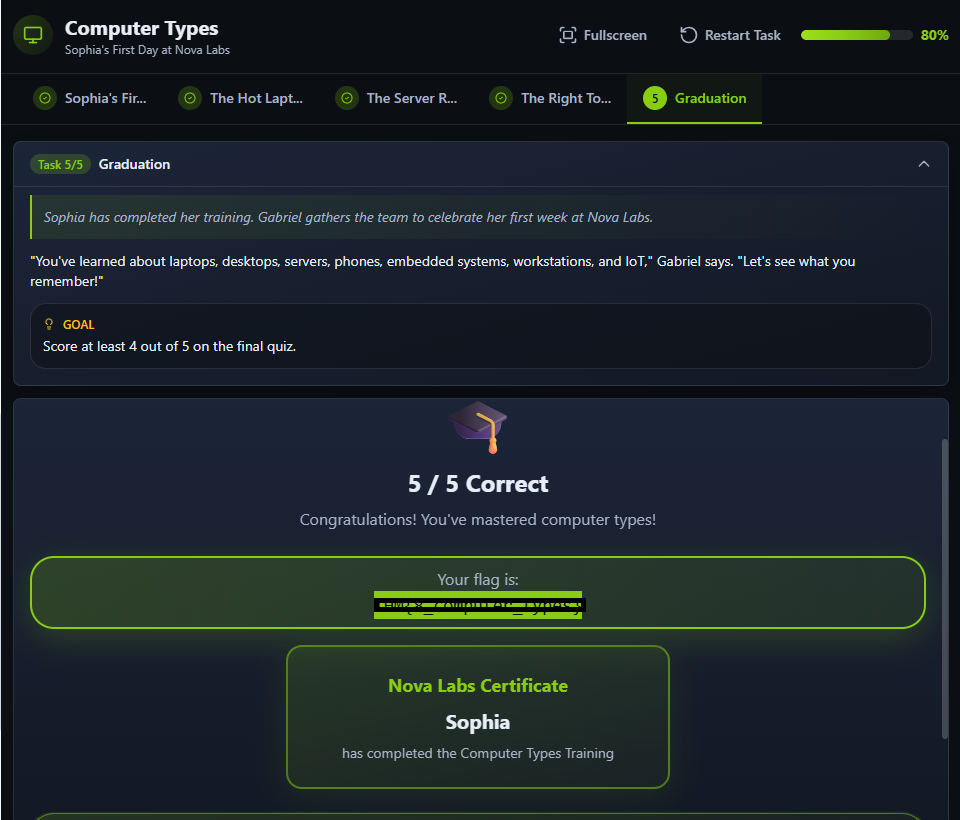

# 💻 Computer Types – Notes (TryHackMe)

## 📌 Overview
In this lab, I learned about the different **types of computers** and how they are categorized based on their purpose, size, and power.

This is important for cybersecurity because different systems have **different vulnerabilities and attack surfaces**.

---

## 🧩 Types of Computers

### 🖥️ Personal Computers (PCs)
- Examples: Desktop, Laptop  
- Used for everyday tasks  

🔹 What I understood:
- These are the most common systems people use  
- They are often the **first target for attacks** like phishing and malware  

---

### 🖧 Servers
- Provide services like websites, email, and file storage  

🔹 What I understood:
- Servers are very important in organizations  
- If a server is compromised, it can affect many users at once

---

### 📱 Mobile Devices
- Smartphones and tablets  

🔹 What I understood:
- Very common and always connected to the internet  
- Easily targeted through apps, phishing, and unsafe networks  

---

### 🔧 Embedded Systems
- Computers built into devices to perform a **specific task**  
- Not necessarily connected to the internet  

🔹 Examples:
- Microwave  
- Printer  
- Car systems  

---

### 🌐 IoT Devices (Internet of Things)
- Embedded systems that are **connected to the internet**  
- Can send and receive data  

🔹 Examples:
- Smart TVs  
- Routers  
- Security cameras  

---

🔹 Note:
All IoT devices are embedded systems, but not all embedded systems are IoT.

---

🔐 What I Understood:
- Many IoT devices are **not well secured**  
- They can be used as **entry points for attackers**  
- This makes them a common target in cyber attacks

---

## 🔐 Cybersecurity Insight

One key thing I learned is:

- Different computer types = different security risks  
- Attackers choose targets based on **value and weakness**  

Examples:
- PCs → malware, phishing  
- Servers → data breaches  
- IoT → botnets and network attacks  

---

## 🧠 Key Takeaways

- Not all computers are the same  
- Each type has its own role and risks  
- Understanding this helps in **defending systems better**  

---

## 📸 Practical Screenshot

✅ Successfully completed the practical and captured the flag.

## 🚀 Reflection

This lab helped me realize that cybersecurity is not just about one system. It involves understanding **all types of devices in an environment**.

I’m starting to see how attackers think in terms of targets.

---
