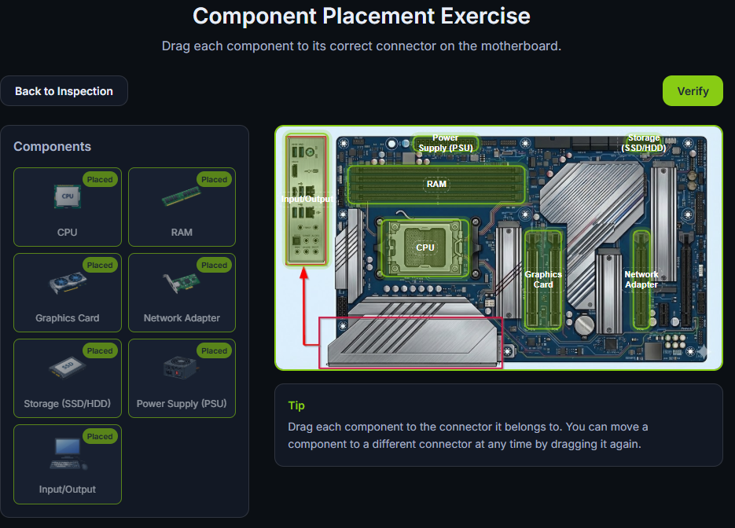
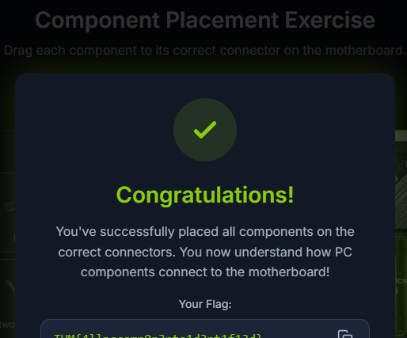
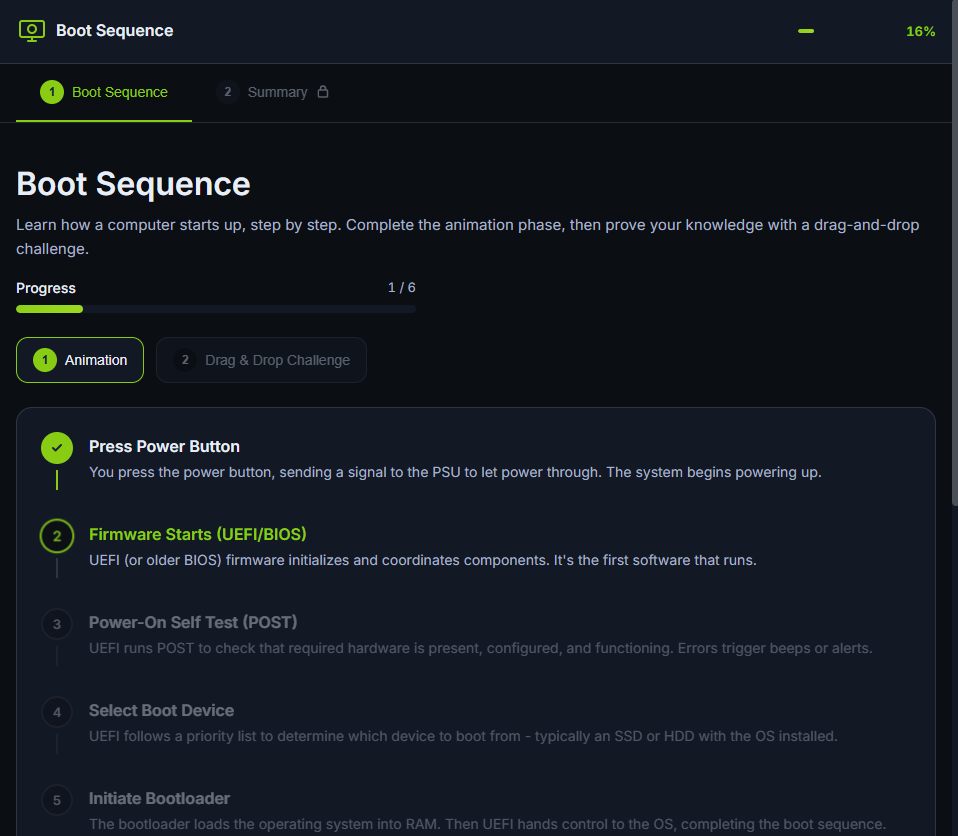

# 🖥️ Inside a Computer System – Notes (TryHackMe)

## 📌 Overview
These notes cover the **core components of a computer system** and the **boot process**, which are foundational concepts for understanding how systems operate and how they can be attacked in cybersecurity.

---

## 🧩 Core Components of a Computer System

### 1. CPU (Central Processing Unit)
- The **brain** of the computer  
- Executes instructions from programs  
- Performs calculations and logical operations

---

### 2. RAM (Random Access Memory)
- Temporary (volatile) memory  
- Stores data currently being used by the CPU  
- Data is lost when power is turned off  

---

### 3. Storage (HDD / SSD)
- Permanent (non-volatile) storage  
- Stores:
  - Operating system  
  - Applications  
  - User files  

---

### 4. Motherboard
- Main circuit board of the computer  
- Connects all hardware components  
- Enables communication between components  

---

### 5. Power Supply Unit (PSU)
- Converts electrical power from outlet into usable form  
- Distributes power to all components  

---

### 6. Input/Output Devices
- **Input:** Keyboard, mouse  
- **Output:** Monitor, speakers  
- Allow user interaction with the system  

---

## Component Placement Exercise

---

---

## ⚙️ Boot Process (Startup Sequence)

The boot process is the sequence a computer follows to start and load the operating system.

### 🔄 Steps:

1. **Power On**
   - System receives power from PSU  

2. **BIOS/UEFI Initialization**
   - Firmware starts up  
   - Performs POST (Power-On Self-Test)  
   - Checks hardware components  

3. **Boot Device Selection**
   - System searches for bootable device (HDD, SSD, USB)  

4. **Bootloader Execution**
   - Bootloader (e.g., GRUB) is loaded  
   - Responsible for loading the OS  

5. **Operating System Loading**
   - Kernel is loaded into RAM  
   - System processes start  

6. **System Ready**
   - Login screen or desktop appears  

---

## Boot Sequence Exercise

---

---

## 🔐 Cybersecurity Relevance

### Why this matters:

- Attackers can target **early boot stages**
- Compromising boot process = deeper system control

### Common threats:
- **Bootkits** – Malware that infects the bootloader  
- **Rootkits** – Hidden malware that maintains persistence  

### Importance:
- Helps in **incident analysis**  
- Improves understanding of **system compromise**  
- Supports **threat detection and response**  

---

## 🧠 Key Concepts to Remember

- Each component has a specific role  
- Components work together as a system  
- Boot process is critical and sensitive  
- Early-stage attacks are harder to detect  

---

## 📚 Quick Summary

- Computer systems rely on hardware components working together  
- The boot process loads the operating system step-by-step  
- Cybersecurity professionals must understand both to detect and prevent attacks  

---
