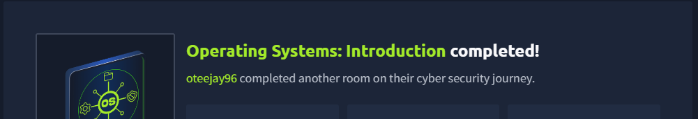

# 🖥️ Operating Systems: Introduction (TryHackMe)

## 📌 Overview
This lab introduces the fundamentals of Operating Systems (OS) and how they manage communication between users, applications, and hardware.

---

## 🧠 Key Concepts

- The OS acts as a bridge between **user, applications, and hardware**
- **Privilege Separation**:
  - Kernel space → full system control  
  - User space → restricted application environment  
- Core OS responsibilities:
  - Process management  
  - Memory management  
  - File system organization  
  - Device and user management  
  - Built-in security (authentication, permissions, isolation)  

---

## 🌍 OS Types

- 💻 Desktop (Windows, macOS, Linux)  
- 🖥️ Server (enterprise, cloud systems)  
- 📱 Mobile (Android, iOS)  
- ⚙️ Embedded (IoT, smart devices)  
- ☁️ Cloud / Virtual environments  

---

## 🐧 Linux Basics

- Linux is a family of distributions:
  - Ubuntu, Debian, Fedora, CentOS  
- Basic file system:
  - `/` → Root  
  - `/home` → User files  
  - `/etc` → Config files  
  - `/var` → Logs  
  - `/bin` → System binaries  

---

## 🔍 Lab Experience

- Worked on an **Ubuntu virtual machine**
- Used both **GUI and CLI**
- Explored:
  - System information  
  - File system structure  
  - Home directory navigation  

---

## 💡 Key Takeaway

Understanding how an OS works makes it easier to analyze system behavior, logs, and security events in real-world SOC environments.

---

## 📸 Lab Completion Screenshot

*✅ Lab successfully completed.*

---
