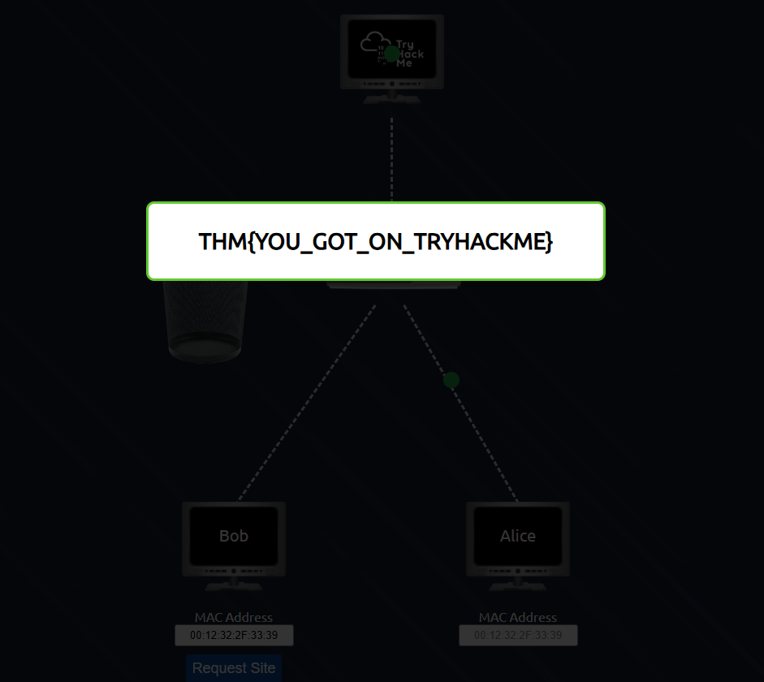

## Networking Fundamentals – Learning Summary

As part of my cybersecurity learning journey, I explored the fundamentals of **networking** and why it plays a critical role in cybersecurity.

A **network** is simply a group of devices connected together so they can communicate and share information. The **internet** is the largest example of this—it is a massive network made up of many smaller **private networks** connected together through a **public network**.

The **World Wide Web (WWW)** was introduced by **Tim Berners-Lee in 1989**, which helped make the internet more accessible and easier for people to use.

### Internet Connecting Multiple Private Networks

**Figure:** Illustration showing how multiple **private networks (Network #1, Network #2, and Network #3)** connect to the **public network (the Internet)** through routers. Each private network contains devices such as computers, servers and mobile devices that communicate internally, while the internet acts as the bridge that allows these separate networks to communicate with each other globally.

### Device Identification on a Network

Devices on a network can be identified using two key addresses:

**1. IP Address (Internet Protocol Address)**  
An IP address works like a digital address that allows devices to locate and communicate with each other on a network.

- **Private IP Address:** Assigned to devices within a local network.
- **Public IP Address:** Assigned by an **Internet Service Provider (ISP)** when a device connects to the internet.
- There are two main versions of IP addresses:
  - **IPv4**
  - **IPv6**
 
  - ## IP Address

*Example of an IP Address (IPv4 and IPv6)*
 
  - ## IPv4 Address Structure

*Example of an IPv4 address (192.168.1.1) showing the four octets. Each octet ranges from 0–255.*

**2. MAC Address (Media Access Control Address)**  
A MAC address is a unique hardware identifier assigned to a device’s network interface during manufacturing.

- The **first 6 characters** identify the manufacturer.
- The **last 6 characters** uniquely identify the device.

- ## MAC Address Structure

- **First 3 bytes (a4:c3:f0)** → Organizationally Unique Identifier (**OUI**) that identifies the vendor (e.g., Intel).
- **Last 3 bytes (85:ac:2d)** → Unique identifier assigned by the manufacturer.

### MAC Spoofing

A MAC address can be altered or **spoofed**, which means a device can pretend to have the MAC address of another device. This technique is known as **MAC spoofing**.

During the **practical exercise**, I analyzed how spoofing can be used to bypass network restrictions and potentially gain access to a Wi-Fi network. This demonstrates why understanding network security mechanisms is important.

## TryHackMe Flag

This confirms successful completion of the task in the TryHackMe lab.

### Network Diagnostic Tool

**Ping** is one of the most basic and widely used network diagnostic tools. It works by sending **ICMP (Internet Control Message Protocol)** packets between devices to check connectivity and measure the response time of a network.

## Task: Test Internet Connectivity

To verify that the machine has internet access, we send ICMP packets to Google's public DNS server.

### Command

ping -c 4 8.8.8.8

Output

  

Explanation

- The ping command sends ICMP echo requests to the target host.
- -c 4 → Sends only 4 packets
- Target → 8.8.8.8 (Google DNS)
- All packets were successfully received
- 0% packet loss confirms connectivity
- Flag THM{I_PINGED_THE_SERVER}

Understanding these networking fundamentals provides a strong foundation for learning **cybersecurity**, as it helps explain how devices communicate, how they are identified and how attackers might attempt to exploit network systems.

